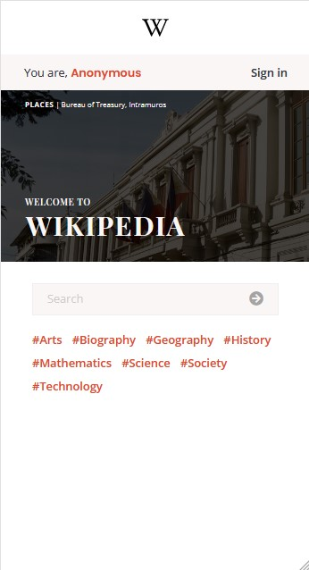
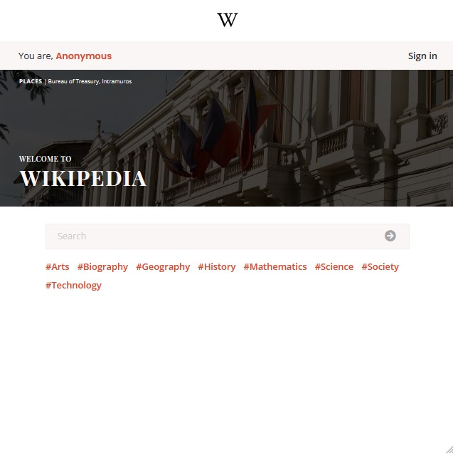
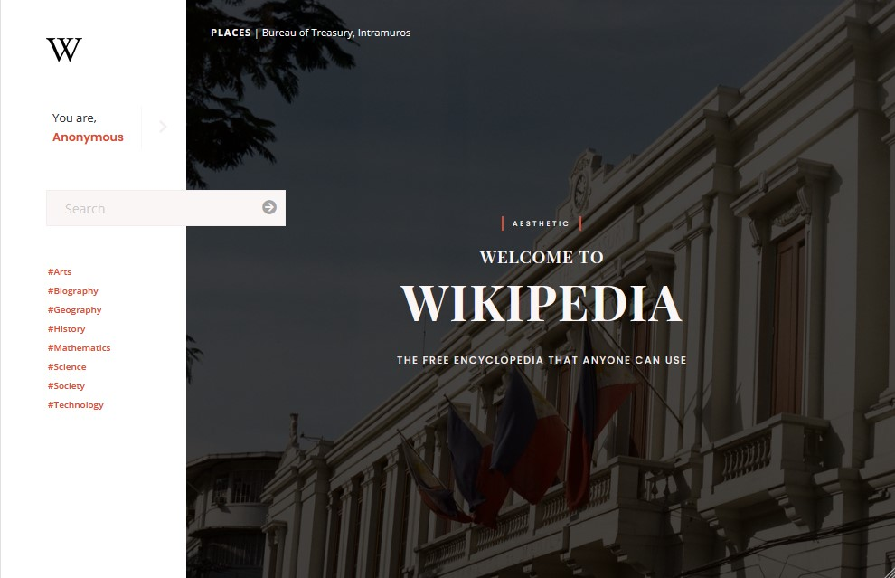
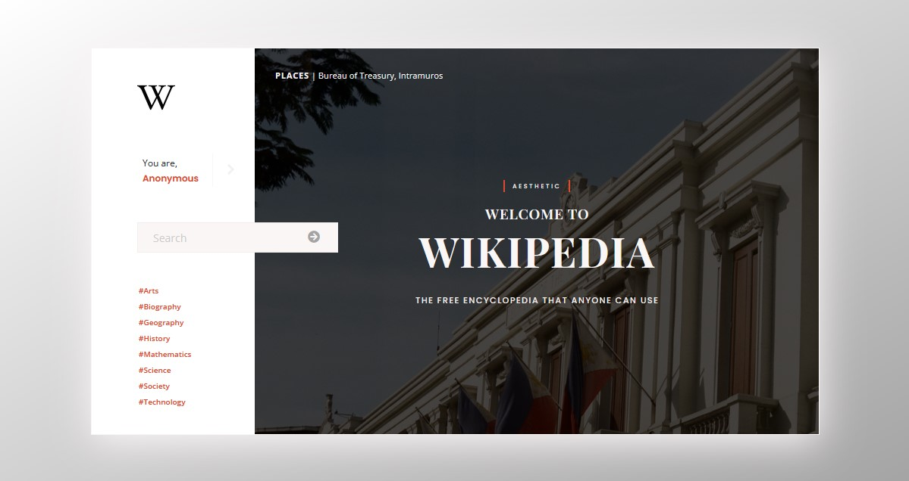
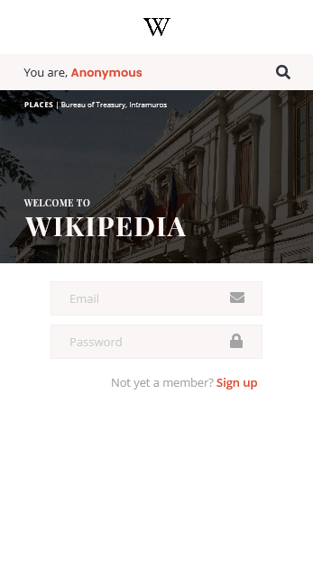
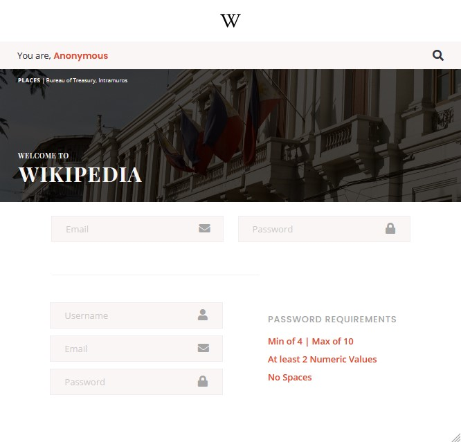
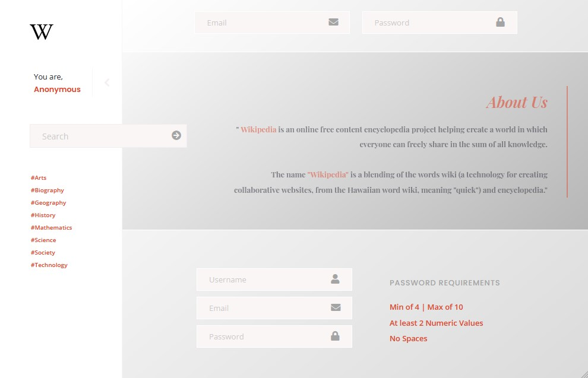
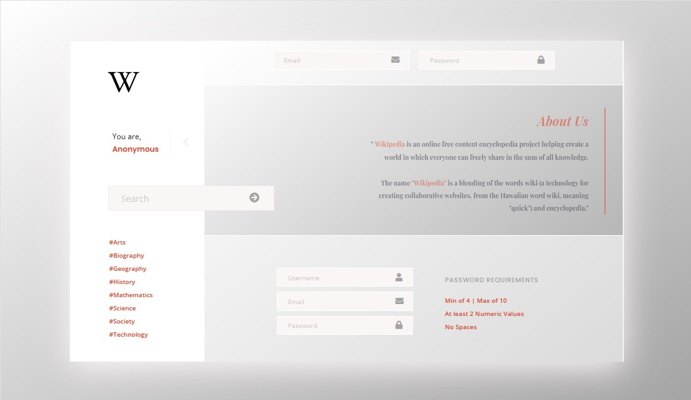

# Wikipedia

#### This is a redesign of wikipedia, created for Betterteem℠ Front-end Software Engineer Assessment
##### This is a project with a progress percentage of (80 / 100)
##### Preview Link: wkpd.netlify.app

### This project consists of:

<table style="width: 100%; border: 0">
  <tr>
    <td>✔ Landing Page</td>
    <td>✔ Animations / Transitions</td>
  </tr>
  <tr>
    <td>✔ Sign-in Page</td>
    <td>✔ Sign-up Page</td>
  </tr>
  <tr>
    <td>✔ Fluid Typography</td>
    <td>✔ Modern CSS Reset</td>
  </tr>
  <tr>
    <td>✔ Fully Responsive</td>
    <td>✔ Icons</td>
  </tr>
  <th colspan="2">✔ Sign Out</th>
</table>

### This project was built with:

<table>
 <tr>
    <td>✔ HTML5</td>
    <td>✔ CSS3</td>
 </tr>
 <tr>
    <td>✔ JavaScript</td>
    <td>✔ SCSS</td>
 </tr>
 <tr>
    <td>✔ 7-1 Architecture</td>
    <td>✔ BEM Methodology</td>
 </tr>
 <tr>
    <td>✔ Local Storage</td>
    <td>✔ Clean Code</td>
 </tr>
</table>

### Questions:

#### What are the unfinished percentage here in this project?
##### 1.) I haven't connected it with 'Wikipedia API'
##### 2.) From that, Details Page wheren't made

#### Why isn't this not seperately branched?
##### I encountered a lot of problems during commits and pulls, I sincerely apologize po sir

#### What's the reason behind late submission?
##### Due to the problems I encountered with branches, commits and pulls so I fixed it as soon as I can, again I sincerely apologize po

### Answer from Question #1
##### Due to lack of time and late view of the given assessment, but I thrived and did my best po sir.

## Overview: Screenshots

### Home Page

### Signin & Signup page

# How to run locally?
#### You can download the ZIP Folder and please strictly use 'Extract Here' and not anything else to avoid unwanted errors and complications. Then simply run the file and it'll go smoothly.

